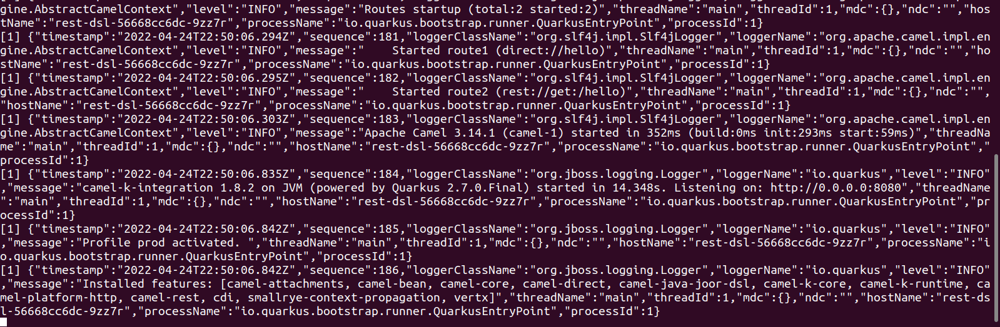

# Logging Trait

This type of trait tells us what is going on in a running integration pod. It does this by printing logs out to the standard output.

Logs are enabled by default on an integration. Just run this example:

     $kamel run logging.java

     $kamel logs logging

Or you can instead get the pod name and print its logs using kubectl: 

     $kubectl get pods

     $kubecttl logs <pod name>

You can configure the log output with the `logging traits` flag:
      
Property | Type | Description 
---|---|---  
logging.enabled | boolean| We can set to false to disable logging
logging.color | boolean| makes logging output colorful. This makes skimming through the logs easier.
logging.json | boolean | Makes logs output to be in json format. We can use tools like `jq` to manipulate output.
logging.json-pretty-print | boolean | It's like using an in built `jq` to print our json output.
logging.level | string | This is just a verbosity level settings. We can just use `info`

for more traits options see this [Link.](https://camel.apache.org/camel-k/next/traits/logging.html).

manual log setting example using  `logging trait`:
     
     $kamel run ./logging.java --trait logging.enabled=true --trait logging.json=true --trait logging.level=info

The output of this result would give this:
- Logging would be enabled, but there would be no colors for easy skimming.
- You would need to use your own jq to pretty print and parse the json output. 

**Image example**

## using modeline 
An example of using a `modeline` to set the `logging traits` : 

     $kamel run ./loggingModeline.java 

