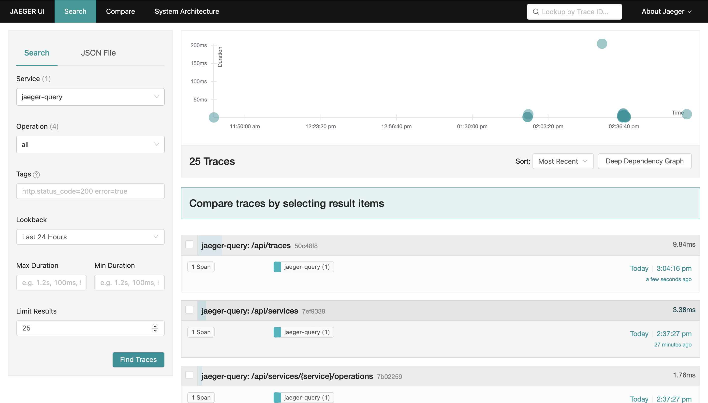

# Camel K Tracing Trait

In this section you will find examples about fine tuning your `Integration` using **Tracing** `trait` capability.

The Tracing trait can be used to automatically publish tracing information of interactions to an OpenTracing compatible collector.

## Configure and Setup Jaeger

1. Enable Ingress addon in Minikube 

    $ minikube addons enable ingress

2. Add Minikube IP to /etc/hosts:

    $ echo "$(minikube ip) example.com" | sudo tee -a /etc/hosts

3. To install Jaeger, make sure the Jaeger operator is installed:

    $ kubetcl apply -f tracing/instance.yaml

4. Apply the Jaeger All-in-one Template:

    $ kubectl apply -f https://raw.githubusercontent.com/jaegertracing/jaeger-kubernetes/master/all-in-one/jaeger-all-in-one-template.yml

## Enable OpenTracing and trace a REST API call in Camel K Route 

Tracing is an important approach for controlling and monitoring the experience of users. We  will be creating two distributed services: `Order` which is a rest service, and `Inventory` which is also a rest service.

Quarkus OpenTracing extension in Camel automatically creates a Camel OpenTracingTracer and binds it to the Camel registry. Simply configure the properties to enable open tracing.

See `quarkus.properties` for details.

    kamel run InventoryService.java --name inventory -d mvn:org.apache.camel.quarkus:camel-quarkus-opentracing  -d camel-jackson --property-file quarkus.properties -t quarkus.enabled=true

Let's inject the Opentracing Tracer to the camel OrderService.java application. Let's start the inventory service. 

See `customizers/OpentracingCustomizer.java` for more details. 

    kamel run --name order OrderService.java customizers/OpentracingCustomizer.java -d camel-opentracing -d mvn:io.jaegertracing:jaeger-client:1.2.0 -d camel-jackson -d camel-undertow -d camel-swagger-java --property-file application.properties

## View the Jaeger UI 

    minikube service jaeger-query --url

In the Jaeger interface we can see the details as:

You can make a few requests the REST Service with custom transaction values defined by curl. 
