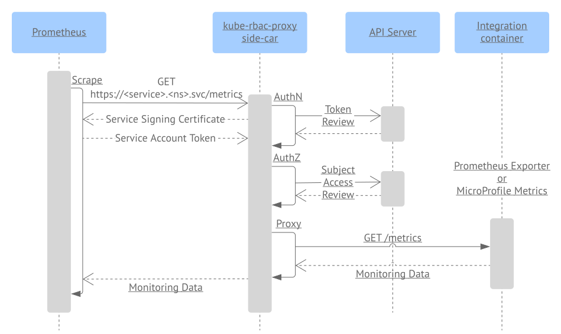
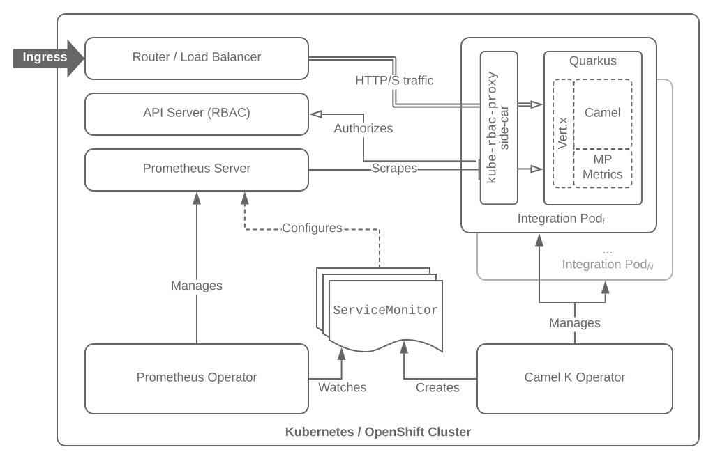
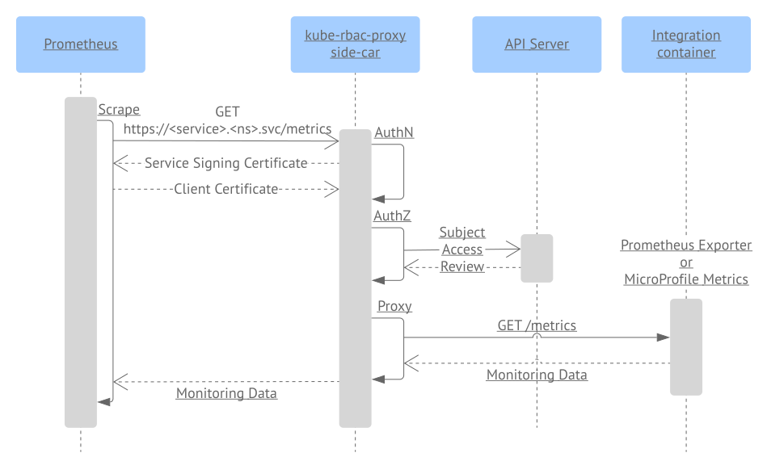

[[monitoring-security]]
= Secured Monitoring

== Summary

This proposal aims at enabling secured integration monitoring using the https://github.com/coreos/prometheus-operator[Prometheus Operator], deployed on Kubernetes or OpenShift.
It focuses specifically on securing the _metrics_ endpoints exposed by the integrations that are configured by the https://camel.apache.org/camel-k/latest/traits/prometheus.html[Prometheus trait].

== Motivation

While these endpoints typically expose read-only monitoring data, that are only accessible from within the cluster, making sure only authorized Prometheus instances can access integrations monitoring data can become a security requirement for multi-tenant clusters, and reduce the surface attack in case of a compromised pod.

== Goals

The goal of this proposal is to secure the communication between Prometheus and the _metrics_ endpoints exposed by the integrations, specifically:

- As a user, I can run an integration whose _metrics_ endpoint has RBAC enabled and auto-configured
- As a user, I can run an integration whose _metrics_ endpoint has TLS enabled and auto-configured

The implementation should rely on standard https://kubernetes.io/docs/reference/access-authn-authz/rbac/[Kubernetes RBAC authorization], as well as the security mechanisms supported by the Prometheus Operator.

== Context

It is recommended to use the Prometheus Operator to set up Prometheus on Kubernetes / OpenShift clusters.

The Prometheus Operator defines the `Prometheus` custom resource definition (CRD) to configure a Prometheus setup, to be run in a Kubernetes cluster.
The operator also defines the `ServiceMonitor` CRD, that is used to define the _metrics_ endpoints that managed Prometheus instances should scrape, based on label selection, as depicted in the following diagram:

image::assets/prometheus-operator.png[Prometheus Operator architecture]

The `ServiceMonitor` CRD declares a `.spec` section that defines a list of target ``Endpoint``s. The `Endpoint` API already supports:

. Bearer token authentication
. Basic authentication (username / password)
. Client certificate authentication
. TLS encryption

As excerpted from the Prometheus operator `v1` API:

[source,go]
----
package v1

import v1 "k8s.io/api/core/v1"

// Endpoint defines a scrapeable endpoint serving Prometheus metrics.
type Endpoint struct {
  // TLS configuration to use when scraping the endpoint
  TLSConfig *TLSConfig `json:"tlsConfig,omitempty"`
  // File to read bearer token for scraping targets.
  BearerTokenFile string `json:"bearerTokenFile,omitempty"` //<1>
  // BasicAuth allow an endpoint to authenticate over basic authentication
  // More info: https://prometheus.io/docs/operating/configuration/#endpoints
  BasicAuth *BasicAuth `json:"basicAuth,omitempty"` //<2>
}

// BasicAuth allow an endpoint to authenticate over basic authentication
type BasicAuth struct {
  // The secret that contains the username for authenticate
  Username v1.SecretKeySelector `json:"username,omitempty"`
  // The secret that contains the password for authenticate
  Password v1.SecretKeySelector `json:"password,omitempty"`
}

// TLSConfig specifies TLS configuration parameters.
type TLSConfig struct {
  // The CA cert to use for the targets.
  CAFile string `json:"caFile,omitempty"`
  // The client cert file for the targets.
  CertFile string `json:"certFile,omitempty"` //<3>
  // The client key file for the targets.
  KeyFile string `json:"keyFile,omitempty"`
  // Used to verify the hostname for the targets.
  ServerName string `json:"serverName,omitempty"`
  // Disable target certificate validation.
  InsecureSkipVerify bool `json:"insecureSkipVerify,omitempty"`
}
----

While the Prometheus trait already supports the auto-configuration of the `ServiceMonitor` resources, it does not leverage these mechanisms, and exposes the integrations monitoring data without authentication nor encryption.

== Proposal

=== Architecture

The _metrics_ endpoint configured by the Prometheus trait can be gated using https://github.com/brancz/kube-rbac-proxy[kube-rbac-proxy], deployed as a side-car container, into the integration pod, and configured using https://kubernetes.io/docs/reference/access-authn-authz/authentication/#service-account-tokens[service account token authentication].

The use of `kube-rbac-proxy` as a side-car has the advantage to encapsulate the authentication and authorization concerns, so that all kind of Prometheus exporters can be used out-of-the-box, seamlessly from the application standpoint.

The communication between Prometheus and the integration during metrics scraping follows the sequence illustrated in the diagram below:

. The Prometheus instance triggers a scraping request to the integration _metrics_ endpoint,
. The _kube-rbac-proxy_ side-car proxies the request,
. The _kube-rbac-proxy_ proxy presents the certificate generated for the integration, that's mounted into the side-car container, to Prometheus that uses it to authenticate the server:
.. On Kubernetes, solutions like https://github.com/jetstack/cert-manager[cert-manager] can be used to implement the certificate issuance,
.. On OpenShift, the Prometheus trait configures a https://docs.openshift.com/container-platform/4.4/authentication/certificates/service-serving-certificate.html[service signing certificate] for the integration pod,
. Prometheus verifies the integration certificate, and compares its identity with the `ServerName` field from the `ServiceMonitor` TLS configuration targeting the integration,
. Prometheus sends the configured service account token to the _kube-rbac-proxy_ proxy that authenticates it by triggering a `TokenReview` request to the API server,
. The _kube-rbac-proxy_ proxy authorizes the user identified with the service account token by triggering a `SubjectAccessReview` request for the `/metrics` resource to the API server,
. The _kube-rbac-proxy_ proxy forwards the authorized request to the upstream integration _metrics_ endpoint that returns the monitoring data.

Quarkus serves all HTTP traffic from a single port, and does not support using a separate port for the _metrics_ endpoint (https://github.com/quarkusio/quarkus/issues/7893[quarkusio/quarkus#7893]). Besides, Knative does not (yet) support declaring multiple container ports in revisions / Knative services (https://github.com/knative/serving/issues/8471[knative/serving#8471]). For these reasons, the _metrics_ endpoint will be served on the same port as the application traffic:

=== Discussion

* While passing a token for client authentication can be a security risk, as the receiving server can use the token to impersonate the client, it is mitigated by the authentication of the integration using its certificate, and the validation of its identity against the `ServerName` field of the corresponding `ServiceMonitor` resource.

* `kube-rbac-proxy` does not currently support restricting authentication for a sub-set of endpoints. As all the traffic served from a single port would be proxied, an option should be added, so that it is possible to enable RBAC only for the _metrics_ endpoint.

* The proposal compatibility with Knative has to be confirmed, in particular, scraping requests made to the same port as the application port should not be taken into account for auto-scaling.

* The proposal compatibility with the ability to migrate from `ServiceMonitor` to `PodMonitoring` should also be assessed: see https://github.com/apache/camel-k/issues/1555[#1555].

== Alternatives

=== Client Certificate

The _metrics_ endpoint configured by the Prometheus trait can be gated using https://github.com/brancz/kube-rbac-proxy[kube-rbac-proxy], deployed as a side-car container, into the integration pod, and configured using client certificate authentication.

The communication between Prometheus and the integration during metrics scraping follows the sequence illustrated in the diagram below:

. The Prometheus instance triggers a scraping request to the integration _metrics_ endpoint,
. The _kube-rbac-proxy_ side-car proxies the request,
. The _kube-rbac-proxy_ proxy presents the certificate generated for the integration, that's mounted into the side-car container, to Prometheus that uses it to authenticate the server:
.. On Kubernetes, solutions like https://github.com/jetstack/cert-manager[cert-manager] can be used to implement the certificate issuance,
.. On OpenShift, the Prometheus trait configures a https://docs.openshift.com/container-platform/4.4/authentication/certificates/service-serving-certificate.html[service signing certificate] for the integration pod,
. Prometheus verifies the integration certificate, and compares its identity with the `ServerName` field from the `ServiceMonitor` TLS configuration targeting the integration,
. Prometheus sends a client certificate, generated using an internal PKI certificate authority, to the _kube-rbac-proxy_ proxy that validates it using the CA public certificate mounted into the _kube-rbac-proxy_ container,
. The _kube-rbac-proxy_ proxy authorizes the user identified with the client certificate by triggering a `SubjectAccessReview` request for the `/metrics` resource to the API server,
. The _kube-rbac-proxy_ proxy forwards the authorized request to the upstream integration _metrics_ endpoint that returns the monitoring data.

The use of both a service signing certificate and a client certificate enables mutual TLS (mTLS).

The https://kubernetes.io/docs/tasks/tls/managing-tls-in-a-cluster/[certificates API] could ideally be used for the client certificate issuance. However, it seems there is no convention about the CA used to sign the certificates, that could be relied on consistently to easily distribute the CA to the applications.

A custom CA could be used, along with solutions like https://github.com/jetstack/cert-manager[cert-manager] to implement the certificate issuance flow.

Conversely, on a typical OpenShift 4 cluster, the service signing CA can be accessed with:

[source,sh]
----
$ oc get secrets/signing-key -n openshift-service-ca -o "jsonpath={.data['tls\.key']}" | base64 --decode > ca.key
----

However, the service signing certificates cannot be used for client authentication.

=== Network Policies

`NetworkPolicies` resources could be used to isolate tenants, though they are not supported by all providers, installers and distributions. Besides, they do not address the case where an attacker gains control of a pod, from which it’d be possible to discover sensitive information about the workload within this pod network policies graph.

=== Basic Authentication

While the Prometheus operator supports basic authentication (via the `BasicAuth` field from the `ServiceMonitor` resource), it is not supported by _kube-rbac-proxy_. Not using the later would require direct communication to the Prometheus exporters, hence requiring them to handle authentication and authorisation, leading to duplication. Besides, username / password credentials lifecycle would not be handled by the platform, as it is for tokens and certificates, e.g., expiry, rotation, …
