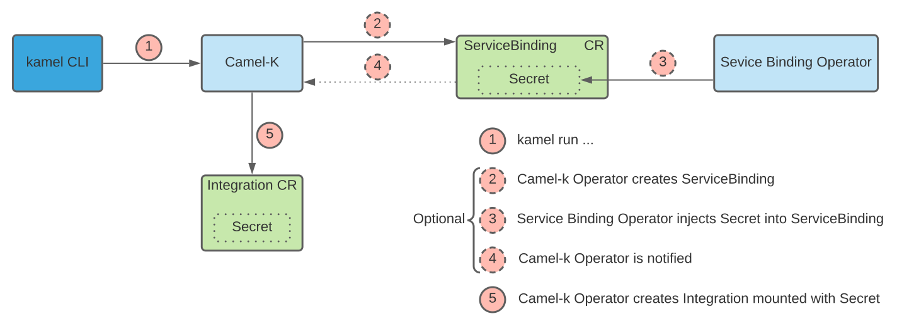

[[service-binding]]
= Service Binding

== Summary

This proposal aims at leveraging the https://github.com/k8s-service-bindings/spec#service-binding[Service Binding Specification] in Camel-k. 

=== Terminology

* _Provisioned Service_ 
** A service e.g a Database or a Broker that can be _bound_ to an application by means definied in the https://github.com/k8s-service-bindings/spec#provisioned-service[specification]
* _Application_
** In the context of Camel-k is an `Integration`

== Motivation

Users should be able to connect to a _Provisioned Service_ by specifying one or more __Service Binding__s in the command line:

```
kamel run intergration --connect database,broker
```

The _Service Binding_ could be referenced by name like shown above, in which case the _Service Binding_ already exists, or it could be created and managed by Camel-k in which case the user would have to explicitly specify the _Provisioned Service_ they want to connect to:

```
kamel run intergration --connect Database.v1alpha1.postgresql.baiju.dev/db-demo
```

The user may then reference the binding properties inside the integration just like any other properties.

== Goals

The goal of this proposal is to provide the current state of the https://github.com/k8s-service-bindings/spec#service-binding[Service Binding Specification] and how it might be leveraged in Camel-k to ease route configuration and facilitate their reusability.

== Context

The specification can be split into two categories: the _Service Binding Operator_ and the _Provisioned Service_ implementation. Several implementations of the _Service Binding Operator_ can be found readily available. Two have have been tried in the context of this proposal: https://github.com/vmware-labs/service-bindings and https://github.com/redhat-developer/service-binding-operator. _Provisioned Services_ implementations are still work in progress and aren't readily available. A list of https://github.com/k8s-service-bindings/spec/issues/16[first] and https://github.com/k8s-service-bindings/spec/issues/19[second] wave of specification adopters  is maintained. Knowing this, usability of the `Service Binding Specification` remains limited. However an initial effort may be done in order to better understand how Camel-k can benefit from it.

=== Workflow

Two main workflows have been identified in the specification that allows user applications to bind to a _Provisioned Service_. Let's review them and see which one would suit Camel-k the best.

The first way outlined in the specification is for the user to create a `ServiceBinding` indicating which _application_ to bind to which set of _Provisioned Services_:

[source,yaml]
----
kind: ServiceBinding
metadata:
  name: account-service
spec:
  application:
    apiVersion: apps/v1
    kind:       Deployment
    name:       camel-k-integration

  service:
    apiVersion: com.example/v1alpha1
    kind:       Database
    name:       my-database
----

Once created, it is the responsibility of the _Service Binding Operator_ to inject the binding information into the _application_. The _application_  is any `PodSpec`-able resource e.g a `Deployment`. The way it does this is that it first scales the `Deployment` down to 0. Then it injects the binding information into the `Deployment` in the form of a `Secret` or a `ConfigMap`. Finally it scales the `Deployment` back up.

The second way is through https://github.com/k8s-service-bindings/spec#custom-projection-service-binding-example-resource[Custom Projection]. The difference between this approach and the first one is that the binding information injection into the _application_ is not the responsibility of the _Service Binding Operator_ anymore. It wil be the responsibility of another Operator. In our case it will be Camel-k's responsibility to retrieve the binding information and inject it into the `Integration`.

The drawback of the first approach, in the context of Camel-k, is that the ``Integration``'s `Deployment` would be created in an incomplete state and would result in an error the first time the underlying container is started because the binding information is not present. The second drawback is that the ``Integration``'s `Deployment` resource should ideally _not_ be altered by someone other than the Camel-k operator itself. The advantage of using this approach is that less work is needed in Camel-k as injection is taken care of by the _Service Binding Operator_.

Conversely, the drawback of implementing the second approach is that more work is needed as Camel-k would have to retrieve and inject the binding information.
The advantage would be that Camel-k retains full control of the ``Integration``'s `Deployment/Cron/Knative` resource and we can delay the startup until the binding information is available.

For these reasons, it seems that the second approach is preferred in the context of Camel-k.

== Proposal

=== Architecture

The proposed architecture is illustrated in the diagram below:



where the `Secret` created by the _Service Binding Operator_ holds the binding information. Quarkus' Service Binding https://github.com/quarkusio/quarkus/issues/13617[support] could then be leveraged to configure the `Integration`.

The steps `2-4` would not happen if the `ServiceBinding` is created beforehand.

In the Optional steps `2-4`, Camel-k will have to wait until the `ServiceBinding` is injected with the `Secret`. To avoid useless reconciliation loops, a new `Phase` would be added (e.g `IntegrationPhaseWaitingForServiceBinding`) which would pause the integration until Camel-k is notified of a change in the `ServiceBinding`.
